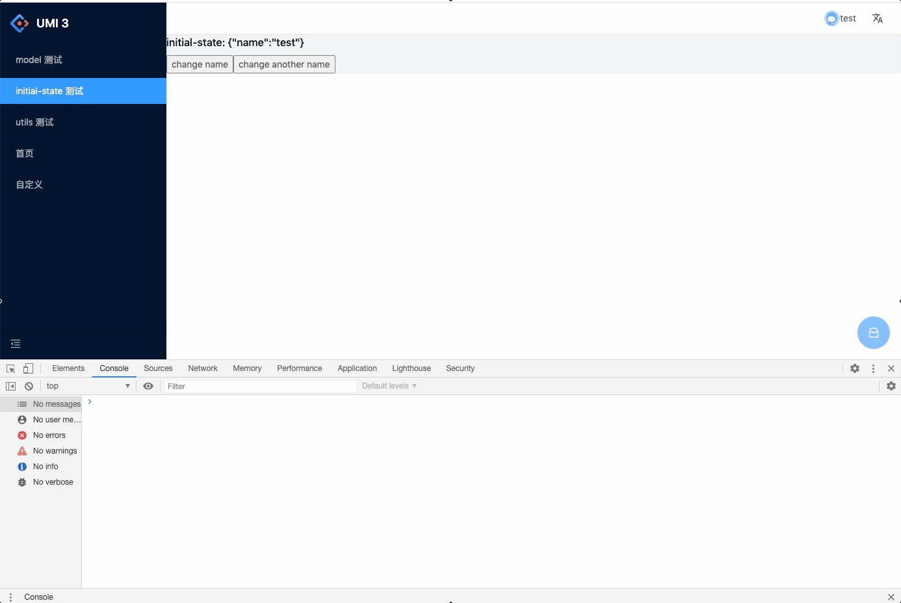

# useModel devTool

## 安装

需要先安装扩展 [Tampermonkey](https://chrome.google.com/webstore/detail/tampermonkey/dhdgffkkebhmkfjojejmpbldmpobfkfo?hl=zh-CN)（Chrome 浏览器）或 [Greasemonkey](https://addons.mozilla.org/firefox/addon/greasemonkey/)（Firefox）。

然后点击下方按钮安装脚本。

## 使用

